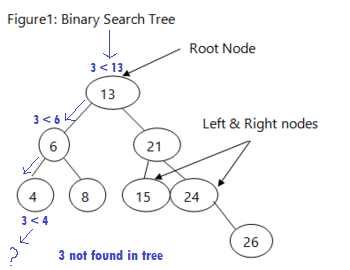

# Common datastructures used in computer programming

Author: [John Francis](john9francis.github.io)

Date: 7/1/2023

There are several types of datastructures used in computer programming to store data. The most commonly known data structure is the list:
```python
my_list = [1,2,3]
```
However, there are many other structures including stack, queue, set, linked list, and tree, to name a few. Each data structure has it's own uses. Each has highest performance for it's specific situation. 

In this tutorial I will be going over the following data structures:

* [Stack](#stack)
* [Set](#set)
* [Tree](#tree)

## Stack
### Introduction


Imagine you're making pancakes for breakfast. As you take each hot pancake off the pan, you place them on top of one another on a stack. Let's say you make 3 pancakes: first, you made pancake 1, then pancake 2, and finally pancake 3, placing them on the stack as you make them. Which pancake get's eaten first?

The pancake at the top of the stack, or the newest pancake (pancake 3) is eaten first. Then pancake 2 is eaten, and finally pancake 1 is eaten. The pancakes are eaten in the opposite order than the order they were placed in the stack.

In programming, a stack follows the same principle. 

In the stack programming data structure, you can't just get any index of the list, you can only access the "newest" item, or the latest one added to the stack. To uncover previous items, you must uncover them by taking things off of the stack. 

### Adding to a stack
In python, we would add to a stack by the following code:
```python
my_stack = []
my_stack.append('item one')
```
The "append" function in python puts something at the end of the list, or the top of the stack. 
### Getting info from a stack
In python, we would take the newest item from the stack with the following code:
```python
my_stack.pop()
```
"pop()" is a function in python that removes and returns the last item from the list. In the example of our stack, it would return the most-recently-added item. 

With these two functions, "append" and "pop," we have everything we need to manipulate a stack. 
### Performance
You may be wondering, why would I use a stack instead of a normal list? Well, one reason is that a stack has very good performance. If you are familiar with Big-O notation, many list operations can be O(n) or even O(n^2). On the other hand, stack operations are almost all just O(1). 

If you think about it, the computer doesn't have to do much to deal with a stack. No matter how big the stack is, you're only dealing with the last entry.

### Example
Here's an example of some stack operations. 
```python
my_stack = []
my_stack.append(1)
my_stack.append(2)
my_stack.pop()
my_stack.append(3)
my_stack.append(4)
my_stack.pop()
my_stack.pop()

print(my_stack.pop())
print(len(my_stack))
```
Try to predict what this code will output. 

Now I will go through and explain what happens in this code. First, a new stack is defined by `my_stack = []`. Then, 1 and 2 are added to the top of the stack. We then took 2 off the stack, leaving my_stack as just [1]. Then we added 3 on top, and 4 on top, making the stack [1,3,4]. Next, we removed the 4, and then removed the 3, lleaving the stack as [1]. 

Finally, we printed `my_stack.pop()` which does two things. First, it takes the 1 off the stack, leaving the stack empty. Second, it prints "1" because the pop() function returns what it popped. Finally, we print the length of the stack with `print(len(my_stack))`. which equals zero.

So the output should be:
```powershell
> 1
> 0
```

### Problem to solve

Write a python function called, "reverse_word" that takes in a string, and using stacks, reverses all the letters in the string. In other words, this should be the output:

```python
print(reverse_word('Hello World'))
```
```powershell
> dlroW olleH
```

[example solution](#example-solutions)

## Set 

### Introduction:


Imagine you have a rock collection. You want to collect one rock of each type. If you find a new rock, and you already have one of that type, you don't need this new rock. This rock collection is like a set. 

A set is a list in which there is one rule:

1. Each value is unique.

So let's say you have a set including the values 1,2, and 3. If you try to add 1 to the set, it will ignore the addition because there is already a 1 in the set. So after the add attempt, your set will still only include 1,2, and 3. 

The purpose of sets is to be very efficient in adding and retrieving data. Another purpose is to find duplicates between data structures. 

### Hashing functions:

A very common practice when making sets is using hashing functions. Hashing functions make it possible for sets to be extremely efficient.

What a hashing function does is take in a non-integer data point, (Like a string, bool, or other object type) and turn it into a unique integer that can be put into a set. For example, a hashing function could turn the string "Hello World" into the code: "19482743." Then that integer can be stored in a set. 

### Adding to a set

In python, we can use the `set` keyword to create a set. If you want to create a set that already has values in it, use curly braces. `{}`

```python
my_set = set()
# or
my_set = {1,2,3}
```

To add to the set, you can use the keyword, "add" provided by python. 
```python
my_set.add(1)
```
If an integer is already found in the set, python will ignore a duplicate.
```python
my_set.add(1)
for x in my_set:
  print(x)
# output: 1

my_set.add(1)
my_set.add(1)
for x in my_set:
  print(x)
# output: 1
```

### Getting info from a set
You can't access a certain index of a set in python using the classic `list[i]` notation, however, you can quickly check if a value is found in the set. You can find a value by utilizing the "in" keyword.
```python
if x in my_set:
  print(x)
```
Another useful thing you can do in sets is detect identical entries in both sets. For example, if you run following python code, it will tell you which values are present in both sets.
```python
set1 = {1,2,3,4,5}
set2 = {3,4,5,6,7}

shared_values = set1 & set2

# display result
for x in shared_values:
  print(x)
# output: 3,4,5
```

### Performance

Hash values work almost like pointers, they are used to access a certain index in the set. Because of this, most set operations are O(1) performance. This is a great benefit of using sets, their excellent performance. 

### Conflicts
Sometimes there will be conflicts with a set when you want to add two of the same exact integer to it. If it's absolutely necessary, there are ways to include two of the same index in a set. These issues are called conflicts. One example of a conflict resolution is having one entry in a set be a list of multiple values. Conflicts in sets can take a toll on the performance, possibly making the set's performance O(n).

### Example

Here's an example of a set. Let's say we have a paragraph, and we want a list of all the unique words in the paragraph. Here's a function using sets to solve our problem. 

```python
paragraph = '''Four score and seven years ago our fathers brought forth on this 
  continent, a new nation, conceived in Liberty, and dedicated to the 
  proposition that all men are created equal. Now we are engaged in a great 
  civil war, testing whether that nation, or any nation so conceived and so 
  dedicated, can long endure. We are met on a great battle-field of that war. 
  We have come to dedicate a portion of that field, as a final resting place 
  for those who here gave their lives that that nation might live. It is 
  altogether fitting and proper that we should do this. But, in a larger 
  sense, we can not dedicate, we can not consecrate, we can not hallow this 
  ground. The brave men, living and dead, who struggled here, have 
  consecrated it, far above our poor power to add or detract. The world will 
  little note, nor long remember what we say here, but it can never forget 
  what they did here. It is for us the living, rather, to be dedicated here 
  to the unfinished work which they who fought here have thus far so nobly 
  advanced. It is rather for us to be here dedicated to the great task 
  remaining before us -- that from these honored dead we take increased 
  devotion to that cause for which they gave the last full measure of 
  devotion -- that we here highly resolve that these dead shall not have died 
  in vain -- that this nation, under God, shall have a new birth of freedom 
  -- and that government of the people, by the people, for the people, shall 
  not perish from the earth.'''

def get_pure_words_list(words):
  '''Takes in a long string of words and returns a list of just the words,
  no punctuation, uppercase letters, or dashes.'''

  # create a list of all the words without punctuation
  word_list = words.lower().replace(',','').replace('.','').split(' ')

  # clean out all the empty strings and returns in the list
  word_list = [word for word in word_list if word != '']
  word_list = [word for word in word_list if word != '\n']
  word_list = [word for word in word_list if word != '--']

  return word_list


def find_unique_words(words):
  '''Takes in a long string and returns a set of only one of each word in 
  the string.'''

  # Get a list of all the words
  word_list = get_pure_words_list(words)

  # use the set feature that only unique entrys will be added
  words_set = set()
  for word in word_list:
    words_set.add(word)

  return words_set


# display the result

for x in find_unique_words(paragraph):
 print(x)

# if you want, get how many unique words are found in this paragraph
total_words = len(get_pure_words_list(paragraph))
unique_words = len(find_unique_words(paragraph))
print(f"There are {total_words} total words")
print(f"There are {unique_words} unique words.")

```
There's kind of a lot going on here, but let's break it down. First, we have a function called, `get_pure_words_list()` That converts the paragraph into a list of words. Then, we have a function called, `find_unique_words()` that uses sets to very quickly find all the unique words in the list. This function simply adds all the entries from the list to a set. The set will ignore the addition if the value is already found in the list. This makes the set only contain the unique words of the paragraph. 

### Problem to solve

Write a function that takes in a list of strings, and use a set to check which words are in both lists. Return a list of only the words that are found in both lists. Also display how many words are in common with the two lists. 

[example solution](#example-solutions)

## Tree

### Introduction


A tree (or binary search tree) is a very useful datastructure. To visualize a tree, I like to think of the "plinko" game. In the game, "plinko," you drop a puck into a board. The puck falls onto a peg. If the puck's weight is more shifted to the right, it rolls off the peg and goes right. If it's weight is more to the left, it rolls off to the left. The puck continues to hit pegs and go left or right, finally settling into it's place at the bottom. 

When you add a value to a tree datastructure, a similar thing happens. The value starts at the first value, and checks if it's bigger or smaller than that value. If the added value is bigger than the first tree value, it gets sent to the "right." If it's less, it gets sent "left." It then compares with the value at that position. The value either goes "left" or "right" again, and continues the process until it gets sent to a position with no value. The value then gets inserted into that position where there was no value. 

### Adding to a Tree

We will be focusing our discussion on Binary Search Trees (BST) which are used to store numbers. 

Let's say we have a tree with the following values. Visually, it's helpful to look at it like this:


The "Root Node," is the first value that our new value is going to encounter. Let's choose a value and go over how to add it to the tree.

Let's say we have a value of 10. To add it to the tree, we are going to play "plinko" with the value.

First, the 10 encounters the root value, 13. Since 10 is less than 13, it gets sent left. There, it encounters a 6. 10 is greater than 6, so it gets sent right. There, it encounters an 8. 10 is greater than 8, so it gets sent right. Finally, there is no value to encounter, so the 10 gets added in this new position. 


### Getting info from a Tree

Getting a value from a BST is very similar to adding a value. Most info you might need from the tree can be found by playing "plinko." 

Let's say we want to find out if our tree contains a certain value. Well, we would start by comparing the value with the root. If the root is equal to the value, then yes, the value is found in the tree and we're done. If the value is not equal to the root, we need to send it either left or right depending on if it's greater than or equal to the root. 

Let's do a visual example. Say we want to find out if the value "3" is found in our binary search tree. Study this diagram to see how we played "plinko" to see if the tree contained a 3. 




### Performance

### Example

Here's an example of a python function for a BST called, "contains." This function will check if the BST contains a certain value. 

We will start by comparing the value of interest with the root value. If the value is bigger, send it right. If it's less, send it left. If it's equal, then return `true` because the value has been found. Then we repeat the process until the value gets found. Here's a sample python function to illustrate how this is implimented:

```python
class BST:
  # ...

  def contains(self, value, current_branch=self.root):
    '''Recursive function that checks if the value is in the tree. '''
    # check if there is a value in this branch
    if current_branch.data == None:
      return false

    # compare the value with the current branch
    if value == current_branch.data:
      return true

    # if value is greater, then run the whole function again on the branch to the right
    if value > current_branch.data:
      contains(value, current_branch.right)

    # if value is less, then run the whole function again on the branch to the left
    if value < current_branch.data:
      contains(value, current_branch.left)

```

In this code snippet, we are assuming we have a class called BST (Binary Search Tree.) We are also assuming that each branch is represented by an object, let's say `self.branch`. This object, `self.branch`, contains a `value` attribute, which is it's number. It also is possibly linked to a `left` branch (with a value less than) and a `right` branch (with a value greater than). 

This function starts at the root branch, and takes in a value. First, it checks if the branch has no data. If this is true, the branch doesn't exist and therefore the value isn't found in the tree, so the function returns `false`.

Next, it checks if the value is equal to the data of the root branch. If this is true, the data is found in the tree, and it's safe to end the function returning `true`. 

In the case that the first two conditions don't apply, it checks if the value is greater than the root. If so, it calls the function again recursively with the `right` branch. This will repeat the whole process with this branch.

Similarly, if the value is less than the root, it will call the function again on the branch directly to the `left` of the root. This will repeat the process on the left side of the tree.

### Problem to solve


## Example solutions
### Example solution to the stack problem:
```python
def reverse_word(word):
  '''Takes in a word and returns the reverse of it'''

  # put the letters of the word into a stack
  word_stack = []
  for letter in word:
    word_stack.append(letter)

  # create a string for the new word
  new_word = ""

  # pop the letters off the end of the stack and add them to the new word string
  for i in range(len(word_stack)):
    new_word += word_stack.pop()

  return new_word
```

### Example solution to the set problem
```python
speech_1 = '''The media will not show the magnitude of this crowd. Even I, 
when I turned on today, I looked, and I saw thousands of people here, but you 
don’t see hundreds of thousands of people behind you because they don’t want 
to show that. We have hundreds of thousands of people here, and I just want 
them to be recognized by the fake news media. Turn your cameras please and show 
what’s really happening out here because these people are not going to take 
it any longer. They’re not going to take it any longer. Go ahead. Turn your 
cameras, please. Would you show? They came from all over the world, actually, 
but they came from all over our country. I just really want to see what they 
do. I just want to see how they covered. I’ve never seen anything like it. 
But it would be really great if we could be covered fairly by the media. 
The media is the biggest problem we have as far as I’m concerned, single 
biggest problem, the fake news and the big tech. Big tech is now coming into 
their own. We beat them four years ago. We surprised them. We took them by 
surprise and this year, they rigged an election. They rigged it like they’ve 
never rigged an election before. By the way, last night, they didn’t do a bad 
job either, if you notice. I’m honest. I just, again, I want to thank you. 
It’s just a great honor to have this kind of crowd and to be before you. 
Hundreds of thousands of American patriots are committed to the honesty of 
our elections and the integrity of our glorious Republic. All of us here 
today do not want to see our election victory stolen by emboldened radical 
left Democrats, which is what they’re doing and stolen by the fake news 
media. That’s what they’ve done and what they’re doing. We will never give up. 
We will never concede, it doesn’t happen. You don’t concede when there’s 
theft involved.'''

speech_2 = '''Well, they have to deal with the … Look, there is institutional 
segregation in this country. And from the time I got involved, I started 
dealing with that. Redlining, banks, making sure that we are in a position 
where Look, we talk about education. I propose that what we take is those very 
poor schools, the Title 1 schools, triple the amount of money we spend from 
$15 to $45 billion a year. Give every single teacher a raise to the equal of … 
A raise of getting out of the $60,000 level. No. 2, make sure that we bring in 
to the help with the stud—the teachers deal with the problems that come from 
home. The problems that come from home, we need… We have one school psychologist 
for every 1,500 kids in America today. It’s crazy. The teachers are required 
I’m married to a teacher. My deceased wife is a teacher. They have every 
problem coming to them. Make sure that every single child does, in fact, have 
three, four, and five-year-olds go to school. School! Not day care, school. We 
bring social workers into homes of parents to help them deal with how to raise 
their children. It’s not that they don’t want to help. They don’t know what— 
They don’t know what quite what to do. Play the radio. Make sure the television 
excuse me, make sure you have the record player on at night. The phone—make sure 
the kids hear words. A kid coming from a very poor school—er, a very poor 
background will hear 4 million words fewer spoken by the time they get there.'''

def get_pure_words_list(words):
  '''Takes in a long string of words and returns a list of just the words,
  no punctuation, uppercase letters, or dashes.'''

  # create a list of all the words without punctuation
  word_list = words.lower().replace(',','').replace('.','').split(' ')

  # clean out all the empty strings and returns in the list
  word_list = [word for word in word_list if word != '']
  word_list = [word for word in word_list if word != '\n']
  word_list = [word for word in word_list if word != '--']

  return word_list


word_list1 = get_pure_words_list(speech_1)
word_list2 = get_pure_words_list(speech_2)

def find_similar_entries(list1, list2):
  '''Takes in two lists and uses sets to find only the entries present in both 
  lists'''
  set1 = set(list1)
  set2 = set(list2)

  return set1 & set2


# displaying the result:
for x in find_similar_entries(word_list1, word_list2):
  print(x)

# displaying the amount of words in both vs the amount of similar words
print(len(word_list1) + len(word_list2))
print(len(find_similar_entries(word_list1, word_list2)))
```
